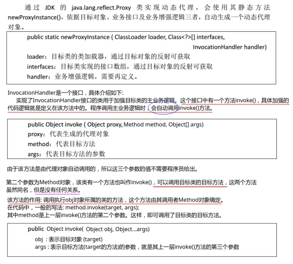

<!--
 * @Author: your name
 * @Date: 2020-04-01 15:40:43
 * @LastEditTime: 2020-04-01 16:03:46
 * @LastEditors: Please set LastEditors
 * @Description: In User Settings Edit
 * @FilePath: \GitHubnotebook\java学习笔记\设计模式.md
 -->
## 1.代理模式

代理模式是对象的结构模式
代理模式给某一个对象提供一个代理对象，并由代理对象控制对原对象的引用(接口的引用)

### 1.1 静态代理

静态代理是指，代理类在程序运行前就已经定义好，其与**目标类(被代理类)**的关系在程序运行前就已经确立。

案例: 比如我们有一个可以移动的坦克，它的**主要方法是move()**，但是我们需要记录它移动的时间，以及在它移动前后做日志

    public interface Movable {
        void move();
    }
    public class Tank implements Movable {
        @Override
        public void move() {
            // 坦克移动
            System.out.println("Tank Moving......");
            try {
                Thread.sleep(new Random().nextInt(5000)); // 随机产生 1~5秒, 模拟坦克在移动　
            } catch (InterruptedException e) {
                e.printStackTrace();
            }
        }
    }

两个代理类:**TankTimeProxy**和**TankLogProxy**

    public class TankTimeProxy implements Movable {

        private Movable tank;

        public TankTimeProxy(Movable tank) {
            this.tank = tank;
        }

        @Override
        public void move() {
            // 在前面做一些事情: 记录开始时间
            long start = System.currentTimeMillis();
            System.out.println("start time : " + start);

            tank.move();

            // 在后面做一些事情: 记录结束时间,并计算move()运行时间
            long end = System.currentTimeMillis();
            System.out.println("end time : " + end);
            System.out.println("spend all time : " + (end - start)/1000 + "s.");
        }
    }
    public class TankLogProxy implements Movable {

        private Movable tank;

        public TankLogProxy(Movable tank) {
            this.tank = tank;
        }

        @Override
        public void move() {
            // tank 移动前记录日志
            System.out.println("Tank Log start.......");

            tank.move();

            // tank 移动后记录日志
            System.out.println("Tank Log end.......");
        }
    }

测试

    public class Client {
        public static void main(String[] args){
            Movable target = new TankLogProxy(new TankTimeProxy(new Tank()));    //先记录时间，再记录日志
    //        Movable target = new TankTimeProxy(new TankLogProxy(new Tank())); //先记录日志，再记录时间
            target.move();
        }
    }

输出:

    Tank Log start.......
    start time : 1551271511619
    Tank Moving......
    end time : 1551271514522
    spend all time : 2s.
    Tank Log end.......

这其中有两个很重要的点，那就是:
· **两个代理对象内部都有着被代理对象(target)实现的接口的引用**；
· **且两个代理对象都实现了被代理对象(target)实现的接口**；

## 1.2 动态代理
动态代理是指，程序在整个运行过程中根本就不存在目标类的代理类(在JDK内部叫$Proxy0，我们看不到)，目标对象的代理对象只是由代理生成工具(如代理工厂类) 在程序运行时由 JVM 根据反射等机制动态生成的。代理对象与目标对象的代理关系在程序运行时才确立。
对比静态代理，静态代理是指在程序运行前就已经定义好了目标类的代理类。代理类与目标类的代理关系在程序运行之前就确立了。

下面看使用动态代理解决上面的问题(可以用TimeProxy代理一切对象):

    public interface Movable {
        void move();
    }
    public class Tank implements Movable {
        @Override
        public void move() {
            // 坦克移动
            System.out.println("Tank Moving......");
            try {
                Thread.sleep(new Random().nextInt(5000)); // 随机产生 1~5秒, 模拟坦克在移动　
            } catch (InterruptedException e) {
                e.printStackTrace();
            }
        }
    }
    
新增的飞机:

    public interface Flyable {
        void fly();
    }
    public class Plane implements Flyable{
        @Override
        public void fly() {
            System.out.println("Plane Flying......");
            try {
                Thread.sleep(new Random().nextInt(5000)); // 随机产生 1~5秒, 飞机在飞行　
            } catch (InterruptedException e) {
                e.printStackTrace();
            }
        }
    }

我们的关键处理，即编写MyTimeProxyInvocationHandler:// 静态代理做不到既为飞机做时间代理，又为坦克做时间代理，但是动态代理可以为所有对象做代理

    public class MyTimeProxyInvocationHandler implements InvocationHandler {

        private Object target;//注意这里是 Object ，不是Movable或者Flyable

        public MyTimeProxyInvocationHandler(Object target) {
            this.target = target;
        }

        // proxy  : 代理对象  可以是一切对象 (Object)
        // method : 目标方法
        // args   : 目标方法的参数
        @Override
        public Object invoke(Object proxy, Method method, Object[] args) throws Throwable {

            // 在前面做一些事情: 记录开始时间
            long start = System.currentTimeMillis();
            System.out.println("start time : " + start);

            method.invoke(target, args); // 调用目标方法  invoke是调用的意思, 可以有返回值的方法(我们这里move和fly都没有返回值)

            // 在后面做一些事情: 记录结束时间,并计算move()运行时间
            long end = System.currentTimeMillis();
            System.out.println("end time : " + end);
            System.out.println("spend all time : " + (end - start)/1000 + "s.");

            return null;
        }
    }

最后测试类:

    public class Client {
        public static void main(String[] args){
            Movable tank = new Tank();
            //可以为所有对象产生时间代理的 InvocationHandler
            MyTimeProxyInvocationHandler myInvocationHandler = new MyTimeProxyInvocationHandler(tank);
            Movable tankProxy = (Movable) Proxy.newProxyInstance(
                    tank.getClass().getClassLoader(),
                    tank.getClass().getInterfaces(),
                    myInvocationHandler
            );
            tankProxy.move();

            System.out.println("--------------------");

            Flyable plane = new Plane();
            myInvocationHandler = new MyTimeProxyInvocationHandler(plane);
            // 为飞机产生代理, 为..产生代理，这样可以为很多东西产生代理，静态代理做不到
            Flyable planeProxy = (Flyable) Proxy.newProxyInstance(
                    plane.getClass().getClassLoader(),
                    plane.getClass().getInterfaces(),
                    myInvocationHandler
            );
            planeProxy.fly();
        }
    }

输出(同时为Tank和Plane做了代理):

    start time : 1551275526486
    Tank Moving......
    end time : 1551275531193
    spend all time : 4s.
    --------------------
    start time : 1551275531195
    Plane Flying......
    end time : 1551275532996
    spend all time : 1s.
